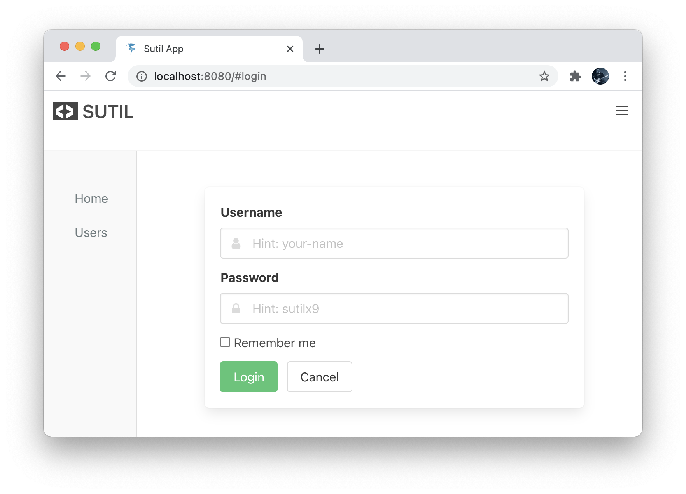

## Sutil Template for SPA

A full app that demonstrates some commonly required features in an SPA

Features:
- Sveltish transitions (in response to media query)
- Elmish architecture
- Reactivity using Sveltish stores
- Navbar
- Login
- CRUD
- Routing
- Multipage
- Sidebar
- Bulma styling

### Quick Start

```
    dotnet new install Fable.Sutil.Templates
    mkdir myapp
    cd myapp
    dotnet new sutil-app
    dotnet tool restore
    npm install
    npm run start
```


